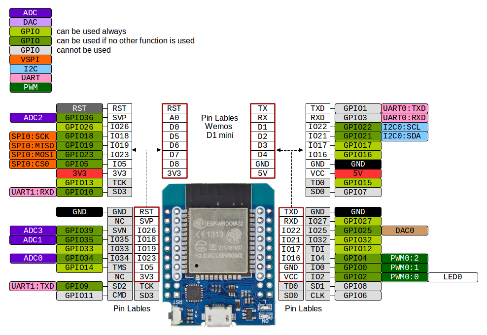
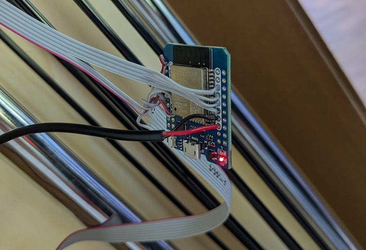
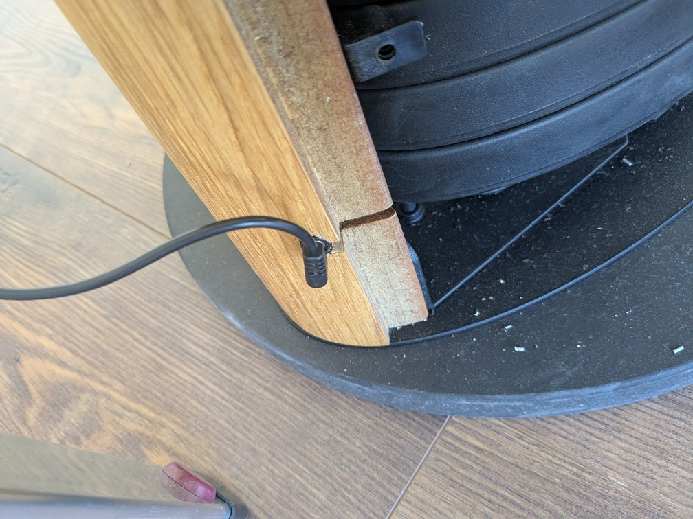
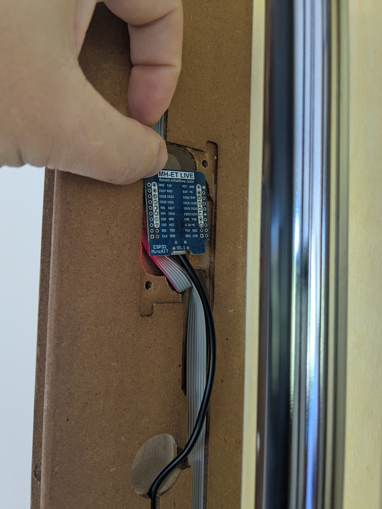
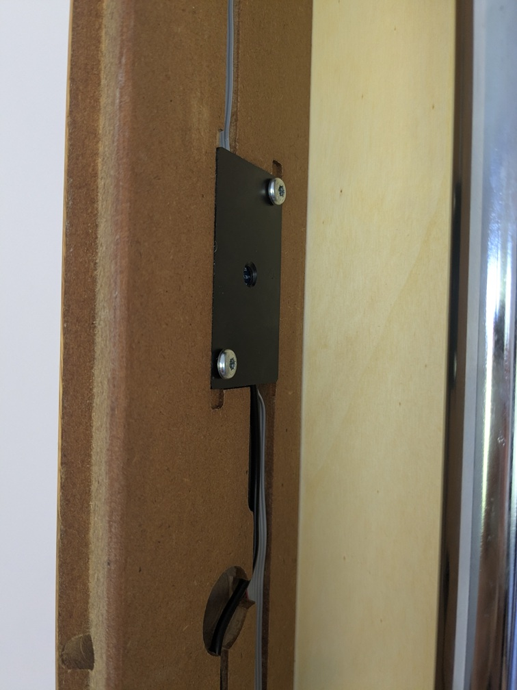
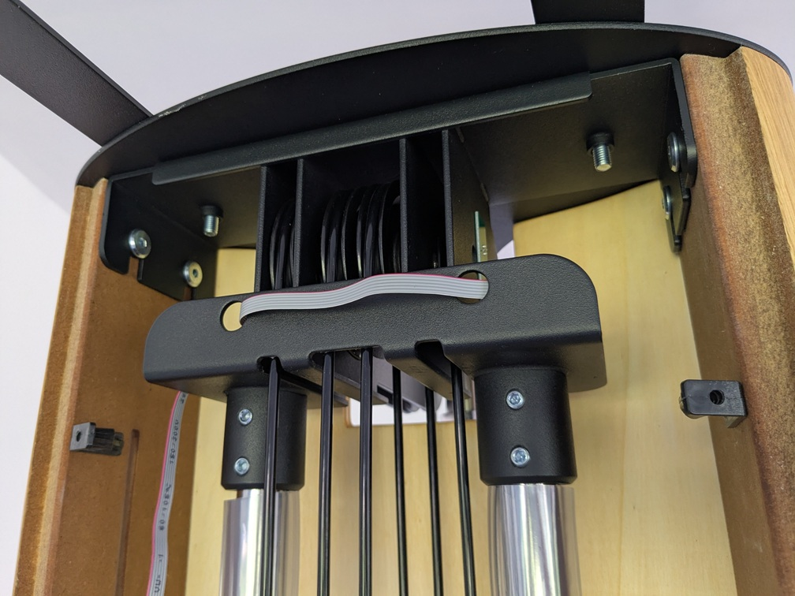

# SlimBeam of NOHRD

The SlimBeam Cable Pull Tower has all the sensors to measure the pull distance and the lifted weigth built in already, so adding a ESP32 to broadcast the values wirelessly is pretty easy. Even the sensor- and power-cables can be reused.


## Partlist

 - 1x [Powersupply](https://www.amazon.de/dp/B00MUI7ROW): 5V DC, 4.0mm x 1.7mm plug, the same as the Sony PSP is using.
 - 1x [Micro-MaTch 4pin header](https://www.conrad.at/de/p/te-connectivity-stiftleiste-standard-micro-match-polzahl-gesamt-6-rastermass-1-27-mm-7-215083-6-1-st-747917.html) (male) 1.27mm, PartNr 7-215083-4
 - 1x [Micro-MaTch 6pin header](https://www.conrad.at/de/p/te-connectivity-stiftleiste-standard-micro-match-polzahl-gesamt-6-rastermass-1-27-mm-7-215083-6-1-st-747917.html) (male) 1.27mm, PartNr 7-215083-6
 - 1x Ribbon cable 6pins, 0.6m
 - 1x ESP32 MiniKit or similar; no headers; rather on the small side

One the MCU no pin headers have been used and the cables are soldered directly to the MCU.

Note: Buy more Micro-MaTch headers. I broke one of each when crimping to the cable. They are tiny and brittle.

## Pins

For the weight measurements, two AtmelQT1070, with 7 sensors each, are used and connected via two separate I²C ports. The cable to the MCU is built in already.
```
 1 GND
 2 SCL1
 3 RESET
 4 SDA1
 5 VDD
 6 SCL2
 7 N/C
 8 SDA2
```

The distance sensor is a rotary encoder for the left and right pully each. Both are connected to the 6pin ribbon cable, the one sensor has the 6pin header, the other the 4pin header.

```
 1 VDD
 2 GND
 3 Sig R1
 4 Sig R2
 5 Sig L1
 6 Sig L2
```

The MCU is powered by the 5V VCC, the sensors get the 3.3V power from the MCU.

```
 1 GND
 2 26 (SCL1)
 3 34 (RESET)
 4 18 (SDA1)
 5 3V3
 6 19 (SCL2)
 7 NC
 8 23 (SDA2)

 1 3V3
 2 GND
 3 16 (Sig R1)
 4 17 (Sig R2)
 5 21 (Sig L1)
 6 22 (Sig L2)

 1 5V red wire (VCC)
 2 GND black wire (GND)
```





## Cables

The good thing is that all cables are nicely hidden. There is a power connector at the basis, a cable to the MCU present.



Also a place where the MCU goes into.




Even the ribbon cable has space prepared on top and a carving in the frame (left).


## Calibration of the weight sensor

Once all is ready, press the Calibrate button in Home Assistant. This copies the current sensor values into the reference registers and then pull all 14 weights until you cannot see them anymore. This completes the calibration.

## Code logic

The distance measurement is a normal quatruple encode for the direction using two photo sensors each for the direction. Their resolution is not too high, probably in the 5cm range. I am not sure if the ESPHome considers falling and rising edges, so maybe that can be improved.

The weight sensor ([Datasheet](https://ww1.microchip.com/downloads/en/DeviceDoc/Atmel-9596-AT42-QTouch-BSW-AT42QT1070_Datasheet.pdf)) is pretty advanced. It has many features that are useful if used as real touch panel, but some interfere with our use case. For example, it assumes that during calibration no sensors are touched and enables a functionality to prevent two neighboring buttons to be pressed by accident, they get automatically recalibrated after a few seconds and the value distance between touched/not touched is rather high.

In our use case, this is all wrong. In the idle state all touch sensors are "pressed", because the weights are near them. For that reason the controller gets different control values set at MCU boot.

1. The sensor difference between touched/not-touched shall be 4 only, not the default 20 `write_byte(32+i, 0x04);`
2. Make 8 sensor measurements and average them out `write_byte(39+i, 0b00100000);`
3. Disable the adjacent key protection as in our case all 14 touch panels are pressed in idle `write_byte(39+i, 0b00100000);`
4. Require 4 positive measurements for a press `write_byte(46+i, 0x04)`
5. Disable the recalibration `write_byte(53, 0b00011111);  bit4=1`
6. Disable guard channels `write_byte(53, 0b00011111); bit 0-3=0`
7. Set automatic recalibration after n seconds to off `write_byte(55, 0x00);`

With these settings there is just one problem left: The touch controller is designed to start idle, with nothing pressed. So we would need to pull all weights away from the sensors and then hit calibrate. It does measure pressing a button, meaning a lower value and we need the information which button is not pressed.
But there is another feature, which cannot be disabled and we can use for our advantage. If the button is calibrated to e.g. 1000 and suddenly measured value is lower than that, so in the sensor's logic the touch panel was not pressed and then even more not pressed, it resets the reference value to the lowest value. This feature is not disabled, even when automatic recalibration is turned off and recalibration is disabled.

But we can use that to our advantage by calibrating with all weights down, then pull all weights up until none of the sensors are touched, this changes the reference values to the new lower value and from now on the key bitmap works as desired. With all weights down, the sensor reads all 7 sensors being pressed 0b01111111. When the weight is pulled up, a zero appears to indicate an air gap, e.g. 0b01110111 -> 0b01110011 -> 0b01110001 -> 0b01110000 means 4 weights of the 7 per sensor have been pulled completely.


